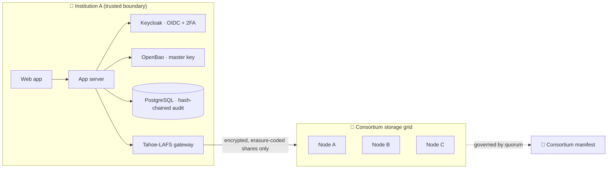

<h1 align="center">Hey, I'm Maxi 👋</h1>

  <b>Software Engineering @ ITBA 🇦🇷 · Exchange @ DTU 🇩🇰</b> 
  I like the layers most people abstract away.

  

  
  

---

## 💫 About me

I'm into **cloud, DevOps, networking and Linux**: how packets actually move between pods, what a scheduler does when you're not looking, and how to keep a deploy boring.

- 🌐 Built virtual network topologies with namespaces, veth pairs, **Open vSwitch** and **VXLAN** at DTU
- 🐧 Wrote an x86-64 kernel with a scheduler, buddy allocator, semaphores and pipes
- 🚀 Ship a production platform for a law firm with CI/CD on GitHub Actions
- 📚 Currently studying Terraform, Helm, Kubernetes on AWS, gRPC and Kafka

---

## 🏝️ Thesis: Archipelagus

> **Distributed custody of clinical records between health institutions that don't need to trust each other.**

Argentina's health sector has been hit by ransomware, mass data leaks and single-vendor breaches exposing dozens of clinics at once. Archipelagus lets institutions **back each other up** on a shared storage grid where **nobody can read what they host for others**, and no central operator holds data, keys or power.

- 🔐 Files are **encrypted client-side** and **erasure-coded** before leaving the institution
- 🧩 Shares are dispersed across nodes that can't read or rebuild them
- 🗳️ The consortium is governed by a **committee deciding by quorum**; one breach stays inside one institution
- 🧱 Stack: Tahoe-LAFS · Keycloak · OpenBao · PostgreSQL · Celery + Redis

---

## 🛠️ Things I've built

| | Project | What's inside |
|---|---|---|
| 🧦 | [**POROTOS: SOCKS5 proxy**](https://github.com/MatiasColeur/TP-PROTOS) | Non-blocking SOCKS5 server in C (RFC 1928/1929): selector multiplexer, state machine, IPv4/IPv6/FQDN, auth, and a custom TCP admin API with live metrics |
| 🐧 | [**x86-64 kernel**](https://github.com/MaxiChiate/TP2-SO) | Bare-metal OS on QEMU: process scheduler, buddy memory manager, semaphores, IPC, syscalls and a userland shell, built inside Docker |
| ☸️ | **Kubernetes cluster networking** *(DTU)* | Multi-node cluster with CNI pod networking and service discovery, Ansible-automated provisioning, OVS + VXLAN multi-tenant overlays |
| ⚽ | [**Fulbito**](https://github.com/MaxiChiate/Fulbito) | Sports facility booking platform: Java 21 + Spring REST API, TypeScript SPA, PostgreSQL with PL/pgSQL-enforced booking rules, JWT |
| ⚖️ | [**Estudio Candame**](https://github.com/MaxiChiate/estudio_candame_php) | Freelance production platform turning an intake form into filing-ready incorporation paperwork. Ported from Spring/Kotlin to PHP 8.3, deployed via GitHub Actions |
| 🧠 | [**AI Systems**](https://github.com/MaxiChiate/SIA-TPs) | Search algorithms on Sokoban, genetic algorithms, neural networks |
| 🍃 | [**MongoDB & Redis**](https://github.com/gonzasharif/TPO-BD2) | Dockerized Mongo + Redis stack with automated CSV ingestion and indexing |

---

## 💻 Tech stack

### ☁️ Cloud & Infra

### 🐧 Systems & Networking

### 🔁 CI/CD

### ⚙️ Backend

### 🗄️ Data

---

<picture>
  <source media="(prefers-color-scheme: dark)" srcset="https://raw.githubusercontent.com/MaxiChiate/MaxiChiate/output/snake-dark.svg" />
  
</picture>
🇦🇷 Spanish (native) · 🇬🇧 English (advanced) · Buenos Aires

